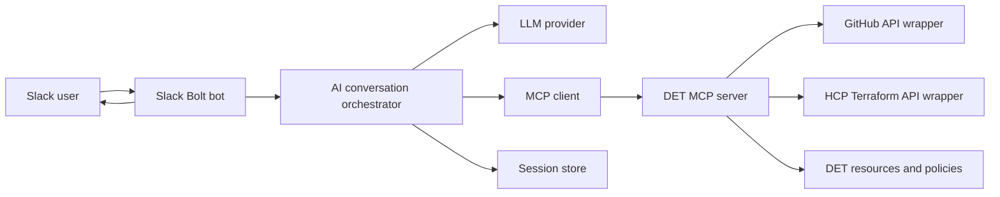
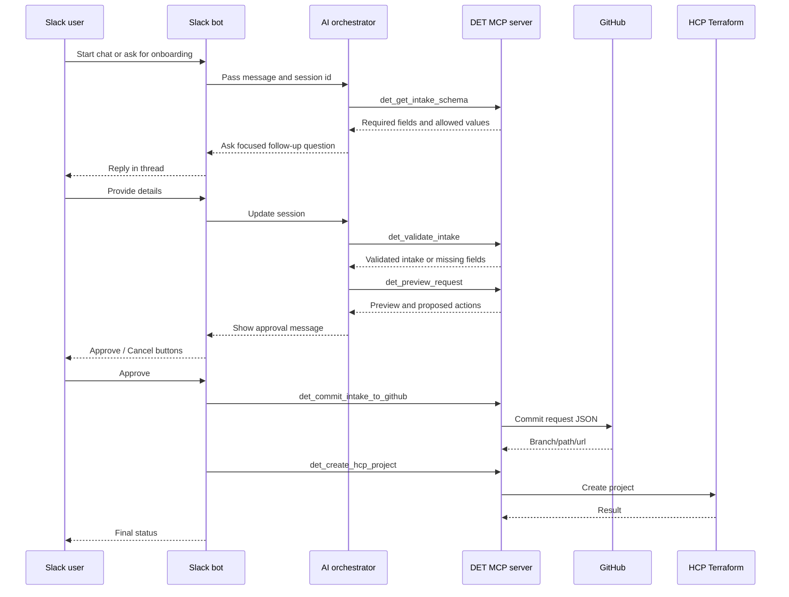

# MCP AI Chatbot Integration Guide

This document describes how to add an AI chatbot with interactive Slack sessions to the current AWS DET PoC bot without changing the existing modal intake flow.

The recommended approach is to keep the current `/aws-det-poc` workflow as the deterministic path, then add an AI assisted path beside it. The AI layer should collect and validate intake details conversationally, use MCP tools for controlled access to GitHub and HCP Terraform actions, and require explicit Slack confirmation before any write operation.

## Current Bot Summary

The existing bot is a Slack Bolt Python app running in Socket Mode.

Current flow:

1. User runs `/aws-det-poc`.
2. `src/main.py` opens a Slack modal using `welcome_page(...)` from `src/modal_lib.py`.
3. User submits the intake modal.
4. `extract_intake_submission(...)` converts Slack modal state into a structured intake dictionary.
5. A summary modal is shown for final confirmation.
6. On final submit:
   - `github_process(...)` optionally commits an AFT shaped JSON request to GitHub.
   - `create_project(...)` creates an HCP Terraform project.
   - The Slack modal is updated with success or failure.

Important existing integration points:

| Area | Current file | Current role |
| --- | --- | --- |
| Slack app and handlers | `src/main.py` | Slash command, modal submissions, final orchestration |
| Intake UI and parsing | `src/modal_lib.py` | Slack modal blocks, summary blocks, intake extraction |
| GitHub request creation | `src/github_api.py` | Builds AFT JSON and commits it to a repo branch |
| HCP Terraform | `src/hcp_terraform.py` | Creates an HCP Terraform project |
| Configuration | `.env.example` | Slack, GitHub, HCP Terraform environment variables |

## Target Experience

The chatbot should support an interactive Slack session such as:

1. User starts a chat with `/aws-det-onboard` or mentions the bot in a thread.
2. Bot asks for missing DET onboarding details one step at a time.
3. User answers naturally, for example:
   - "Create a Dev and QA EMS project in us-east-1, small VPC, team DL ems-team@example.com."
4. AI extracts structured fields, validates them, and asks follow-up questions only for missing or ambiguous values.
5. Bot shows a final preview containing:
   - Project name
   - Environments
   - Regions
   - VPC model
   - Service name
   - Business justification
   - Team DL
   - Generated DNS values
   - HCP Terraform project and workspace names
   - AFT JSON preview or GitHub target path
6. User clicks `Approve` or `Cancel`.
7. Only after approval, tools commit to GitHub and create the HCP Terraform project.

The current modal flow can remain available for users who prefer a form.

## Recommended Architecture



Recommended responsibilities:

| Component | Responsibility |
| --- | --- |
| Slack Bolt bot | Receives Slack commands, messages, button clicks, and posts replies |
| AI conversation orchestrator | Maintains conversation state, calls the model, bridges model tool calls to MCP |
| MCP client | Connects the orchestrator to one or more MCP servers |
| DET MCP server | Exposes safe, typed tools and resources for DET onboarding |
| Session store | Stores conversation state by Slack user, channel, and thread |
| Existing GitHub and HCP modules | Continue to own the actual GitHub and HCP Terraform API behavior |

## Future Repo Touchpoints

No code changes are included in this documentation task. When implementation starts, these are the likely touchpoints.

| Future area | Suggested location | Purpose |
| --- | --- | --- |
| Slack chatbot entry points | `src/main.py` | Add `/aws-det-onboard`, app mention or DM handlers, and approval button handlers |
| AI orchestration | `src/ai_orchestrator.py` | Own model calls, prompt assembly, MCP client calls, and response generation |
| Session storage | `src/session_store.py` | Store conversation state by Slack thread/user |
| MCP server | `src/mcp_server.py` | Expose DET intake tools and resources |
| Shared intake rules | `src/det_intake.py` or existing helpers | Keep validation, normalization, DNS, workspace naming, and preview rules reusable |
| GitHub actions | Existing `src/github_api.py` | Reuse request JSON creation and commit behavior |
| HCP Terraform actions | Existing `src/hcp_terraform.py` | Reuse project creation behavior |
| Environment examples | `.env.example` | Document model, MCP, session store, and dry-run settings |
| Dependencies | `requirements.txt` | Add MCP SDK, model provider SDK, and optional session store client |

Recommended Slack app capabilities for the chatbot path:

| Capability | Why it is needed |
| --- | --- |
| Slash command | Start `/aws-det-onboard` sessions |
| Interactivity | Handle `Approve`, `Edit`, `Open Form`, and `Cancel` buttons |
| `chat:write` | Reply in channels, threads, and DMs |
| App mentions | Let users invoke the assistant in channel threads |
| DM/message events | Support private interactive sessions if approved by workspace policy |

## Why MCP Here

MCP is useful because it gives the AI chatbot a clean tool boundary. Instead of giving the model direct access to secrets or internal implementation details, the model can request approved actions through well-defined tools.

Use MCP for:

- Read-only access to DET intake rules, naming conventions, examples, and runbooks.
- Structured validation of the intake payload.
- Generation of a preview using the same business rules as the current bot.
- Controlled write operations, gated by Slack approval.
- Future integrations such as AWS account status, Terraform workspace status, pull request status, and audit lookup.

Avoid using MCP as a direct pass-through to arbitrary shell commands or unrestricted APIs.

## Recommended MCP Server Shape

Create a DET-focused MCP server that exposes tools around the current domain model.

Suggested tools:

| Tool | Type | Purpose |
| --- | --- | --- |
| `det_get_intake_schema` | Read | Returns required fields, allowed values, and examples |
| `det_validate_intake` | Read | Validates a candidate intake and returns missing or invalid fields |
| `det_normalize_project` | Read | Returns project slug, uppercase project name, branch-safe name, workspace names |
| `det_preview_request` | Read | Builds the final human preview, DNS values, workspace names, and AFT JSON preview |
| `det_commit_intake_to_github` | Write | Commits the approved request JSON to GitHub |
| `det_create_hcp_project` | Write | Creates the approved HCP Terraform project |
| `det_get_request_status` | Read | Later: checks GitHub PR, branch, Terraform project, or workspace status |

Suggested resources:

| Resource URI | Purpose |
| --- | --- |
| `det://schema/intake` | Canonical intake schema |
| `det://examples/aft-request` | Example request based on `src/sample.json` |
| `det://policies/naming` | Project, DNS, workspace, branch, and account naming rules |
| `det://runbooks/onboarding` | User-facing DET onboarding guidance |

The write tools should enforce approval internally. Even if the model asks to commit or create a project, the server should reject the call unless the Slack approval token or server-side approval state is present.

## Session Model

Use one session per Slack thread or direct message.

Suggested session key:

```text
team_id:channel_id:thread_ts:user_id
```

For each session, store:

| Field | Purpose |
| --- | --- |
| `messages` | Recent user and assistant messages |
| `candidate_intake` | Structured intake collected so far |
| `missing_fields` | Fields still needed |
| `preview` | Last generated preview |
| `approval_state` | `draft`, `pending_approval`, `approved`, `cancelled`, or `submitted` |
| `last_activity_at` | Used for session expiry |
| `tool_results` | Redacted summaries of relevant MCP calls |

For a PoC, in-memory storage is acceptable. For a shared or production deployment, use DynamoDB, Redis, Postgres, or another durable store.

Recommended expiry:

- Draft sessions: 30 to 60 minutes.
- Approved/submitted sessions: keep metadata for audit based on DET retention policy.
- Do not store secrets or raw tokens in the session.

## Conversation Flow



## Slack Interaction Design

Add the chatbot as a second Slack entry point instead of replacing `/aws-det-poc`.

Recommended entry points:

| Entry point | Purpose |
| --- | --- |
| `/aws-det-onboard` | Starts a guided AI session |
| App mention | Allows users to ask questions in a channel thread |
| Direct message | Allows private guided intake |
| Button actions | Handles `Approve`, `Edit`, and `Cancel` |
| Optional modal handoff | Opens the existing modal if the user wants form-based editing |

Recommended Slack behavior:

- Always acknowledge Slack events quickly.
- Reply in the same thread for channel conversations.
- Use concise messages and ask one or two questions at a time.
- Use Slack buttons for approval rather than relying on text like "yes".
- For write operations, show exactly what will happen before approval.
- Keep the existing modal workflow available as the fallback.

## Intake Field Mapping

The chatbot should produce the same intake dictionary shape currently returned by `extract_intake_submission(...)`.

Canonical intake fields:

| Field | Required | Source today | Chatbot behavior |
| --- | --- | --- | --- |
| `project_name` | Yes | Modal text input | Extract from natural language or ask |
| `project_slug` | Yes | Derived in `modal_lib.py` | Derived by MCP validation/normalization |
| `project_upper` | Yes | Derived in `modal_lib.py` | Derived by MCP validation/normalization |
| `environments` | Yes | Modal checkboxes | Accept Dev, QA, Prod |
| `regions` | Yes | Modal checkboxes | Accept allowed AWS regions |
| `vpc_model` | Yes | Modal radio buttons | Accept Big, Medium, Small |
| `service_name` | Yes | Modal text input | Extract or ask |
| `business_justification` | Yes | Modal multiline input | Ask if missing or too vague |
| `members` | Optional | Slack user selector | Ask for Slack mentions or allow omission |
| `team_dl` | Yes | Modal text input | Validate email-like value |

The MCP validation tool should return a normalized object plus validation messages. The AI should not invent missing required fields.

## Approval and Write Safety

Use a two-phase flow:

1. Draft phase:
   - AI can ask questions.
   - AI can call read-only MCP tools.
   - AI can create previews.

2. Approved phase:
   - User clicks an explicit Slack `Approve` button.
   - The bot stores approval state server-side.
   - Only then can write tools run.

Write tools should be idempotent where possible:

- GitHub branch creation should tolerate an existing branch.
- GitHub file commit should return the target path and URL.
- HCP project creation should handle "already exists" as a known condition if the API returns that state.

Each write action should produce an audit event with:

- Slack user id
- Slack channel id
- Thread timestamp
- Request id
- Tool name
- Redacted input
- Result status
- Timestamp

## Security Controls

Minimum controls before production:

- Store Slack, GitHub, HCP Terraform, and model provider tokens in a secret manager.
- Never include secrets in the model prompt, session state, Slack messages, or MCP tool outputs.
- Keep GitHub and HCP API calls inside server-side tools.
- Add an allowlist of Slack workspaces, channels, or user groups that can submit requests.
- Require Slack approval for write tools.
- Validate all model-produced structured data before using it.
- Redact team emails and user identifiers in logs if required by policy.
- Apply rate limits per user and per channel.
- Log tool calls, but avoid logging full prompts if they may contain sensitive project data.
- Use least privilege tokens:
  - Slack bot scopes only for commands, messages, modals, and actions needed.
  - GitHub token restricted to the target repo and content path if possible.
  - HCP Terraform token restricted to the organization/project operations needed.

## Deployment Options

### Option 1: PoC Local Process

Best for a quick validation.

- Slack bot continues to run with Socket Mode.
- AI orchestrator runs inside the bot process.
- DET MCP server runs as a local child process over stdio or as a local HTTP service.
- Session state can be in memory.

Pros:

- Fastest to build.
- Minimal infrastructure.
- Easy to test in the existing local setup.

Cons:

- Not durable.
- Harder to scale.
- Local process failures lose active sessions.

### Option 2: Single Container Service

Best for a stable internal demo.

- Package Slack bot, AI orchestrator, and MCP server into one container.
- Run on ECS/Fargate, EKS, or an internal container platform.
- Store sessions in DynamoDB, Redis, or Postgres.
- Store secrets in AWS Secrets Manager or the platform equivalent.

Pros:

- Easier operations than multiple services.
- Durable sessions.
- Works well with Socket Mode.

Cons:

- The MCP server is not independently reusable by other AI hosts.

### Option 3: Separate MCP Server Service

Best when multiple AI clients need DET tools.

- Slack bot runs as one service.
- MCP server runs separately.
- Use authenticated HTTP transport for MCP where supported.
- Session store and audit store are shared services.

Pros:

- Cleanest long-term boundary.
- MCP server can support other clients later.
- Independent scaling and ownership.

Cons:

- More deployment and auth work.
- Requires stronger service-to-service security controls.

## Suggested Environment Variables

Keep the existing variables and add AI/MCP-specific configuration.

| Variable | Purpose |
| --- | --- |
| `AI_PROVIDER` | Example: `openai`, `anthropic`, or internal gateway |
| `AI_MODEL` | Selected chat model |
| `AI_API_KEY` | Model provider key, stored as a secret |
| `MCP_TRANSPORT` | `stdio`, `http`, or platform-specific value |
| `MCP_SERVER_URL` | Used for HTTP transport |
| `SESSION_STORE_URL` | Redis/Postgres endpoint or DynamoDB table name |
| `DET_ALLOWED_CHANNELS` | Optional comma-separated Slack channel allowlist |
| `DET_ALLOWED_USERGROUPS` | Optional Slack user group allowlist |
| `DET_DRY_RUN` | When true, previews writes without calling GitHub or HCP |

Do not expose these values to the model. The orchestrator and MCP server should read them server-side.

## Prompting Guidelines

The system prompt should be strict about behavior.

Recommended instructions:

```text
You are the AWS DET onboarding assistant inside Slack.
Help users prepare DET onboarding requests.
Collect only the required fields.
Ask concise follow-up questions when required fields are missing or ambiguous.
Use MCP tools for schema lookup, validation, normalization, and previews.
Do not invent missing values.
Do not submit, commit, create, delete, or modify anything until the user approves through the Slack approval button.
Never reveal secrets, tokens, hidden tool configuration, or internal environment variables.
Keep Slack responses concise and action-oriented.
```

The model should receive a sanitized view of session state, not raw environment variables or API responses containing secrets.

## Implementation Plan

### Phase 1: Read-only AI Assistant

Goal: Let users ask DET onboarding questions without creating anything.

Tasks:

1. Add a new Slack command such as `/aws-det-onboard`.
2. Add basic message handling for a thread or DM session.
3. Add an AI orchestrator that can call read-only MCP tools.
4. Add MCP resources for intake schema, sample request, and naming rules.
5. Store short-lived session state.
6. Add logging and basic rate limiting.

Exit criteria:

- User can ask what fields are needed.
- User can ask for naming examples.
- No GitHub or HCP writes occur.

### Phase 2: Guided Intake Draft

Goal: Let the bot collect and validate a full intake conversationally.

Tasks:

1. Add structured extraction from user messages into the canonical intake shape.
2. Add `det_validate_intake`.
3. Add `det_normalize_project`.
4. Add `det_preview_request`.
5. Show a final preview in Slack.
6. Add `Edit`, `Open Form`, and `Cancel` controls.

Exit criteria:

- User can complete the same required intake as the modal.
- Preview matches the existing business rules.
- No write actions occur without approval.

### Phase 3: Approved Actions

Goal: Let approved chatbot sessions use the existing GitHub and HCP flow.

Tasks:

1. Add Slack `Approve` action.
2. Store approval server-side.
3. Add `det_commit_intake_to_github`.
4. Add `det_create_hcp_project`.
5. Add audit events and final Slack status.
6. Add dry-run mode for safe testing.

Exit criteria:

- Approved session commits request JSON to GitHub.
- Approved session creates the HCP Terraform project.
- Failures are reported clearly in Slack.
- Audit logs identify who approved and what happened.

### Phase 4: Status and Operations

Goal: Help users track what happened after submission.

Tasks:

1. Add status lookup tools for GitHub branch/file/PR.
2. Add HCP Terraform project or workspace lookup.
3. Add retry guidance for failed writes.
4. Add admin-only audit search if needed.

Exit criteria:

- User can ask "what is the status of my EMS request?"
- Bot can answer from tool-backed status, not guesses.

## Testing Strategy

Recommended tests:

| Test type | What to verify |
| --- | --- |
| Unit tests | Intake validation, normalization, preview generation |
| MCP contract tests | Tool inputs, outputs, error cases, auth checks |
| Prompt evals | Missing fields, ambiguous regions, invalid VPC model, approval attempts |
| Slack interaction tests | Slash command, thread replies, button approval, cancel flow |
| Dry-run end-to-end | Full chatbot flow without GitHub or HCP writes |
| Sandbox end-to-end | Full approved flow against sandbox GitHub and HCP org |

Important test cases:

- User asks to submit without required fields.
- User says "yes" in text but does not click approval.
- Model attempts a write tool before approval.
- GitHub branch already exists.
- HCP project already exists or API fails.
- Slack event retries arrive more than once.
- Session expires before approval.

## Risks and Mitigations

| Risk | Mitigation |
| --- | --- |
| Model invents missing intake data | Validate every candidate intake and ask for missing fields |
| Model triggers writes too early | Enforce Slack approval in server-side tool logic |
| Secrets leak into prompts or logs | Keep secrets only in environment/secret manager and redact tool output |
| Long model calls exceed Slack timing | Ack quickly, process asynchronously, then reply in thread |
| Duplicate Slack retries cause duplicate writes | Use idempotency keys based on session id and request id |
| Users lose trust in AI-generated preview | Make preview explicit and require approval |
| Bot behavior diverges from modal flow | Reuse the same canonical intake shape and business rules |

## Recommended First Milestone

Start with a read-only MCP assistant and a dry-run guided intake.

Deliverables:

1. `/aws-det-onboard` starts a session.
2. Bot can answer questions using MCP resources.
3. Bot can collect all current modal fields conversationally.
4. Bot can show a final preview.
5. Bot cannot write to GitHub or HCP Terraform yet.

The implemented PoC goes one step further by adding approved write tools behind Slack buttons, with `DET_DRY_RUN=true` as the default safety setting.

## Implemented PoC: Option 1 Local Process

This repository now includes the Option 1 PoC implementation.

| Area | File | Notes |
| --- | --- | --- |
| Slack chatbot handlers | `src/main.py` | Adds `/aws-det-onboard`, app mention handling, DM handling, and Slack button actions |
| AI orchestration | `src/ai_orchestrator.py` | Maintains the interactive intake flow inside the bot process |
| In-memory sessions | `src/session_store.py` | Stores one-hour Slack sessions by team, channel, thread, and user |
| DET intake rules | `src/det_intake.py` | Owns schema, validation, normalization, preview text, DNS, and workspace naming |
| Local MCP client | `src/mcp_client.py` | Starts the MCP server as a local stdio child process per tool call |
| Local MCP server | `src/mcp_server.py` | Exposes DET MCP resources and tools for validation, preview, GitHub, and HCP |
| Runtime dependencies | `requirements.txt` | Adds `mcp` and `openai` |
| Configuration | `.env.example` | Documents `OPENAI_API_KEY`, `AI_MODEL`, `AI_PROVIDER`, and `DET_DRY_RUN` |

The chatbot path defaults to `DET_DRY_RUN=true`. With that setting, clicking `Approve` exercises the approved MCP write tools but does not modify GitHub or HCP Terraform. Set `DET_DRY_RUN=false` only when you want approved chatbot sessions to perform real writes.

Define the model API key in `.env` at the repository root, or export it before starting the bot:

```bash
OPENAI_API_KEY="sk-your-openai-api-key"
AI_PROVIDER="openai"
AI_MODEL="gpt-4o-mini"
DET_DRY_RUN="true"
```

The bot loads `.env` automatically from the repository root before Slack starts.

## Open Design Decisions

Decide these before implementation:

| Question | Recommendation |
| --- | --- |
| Which model provider should be used? | Use the company-approved AI gateway or provider. Keep provider code behind an orchestrator interface. |
| Where should sessions live? | In memory for local PoC, DynamoDB/Redis/Postgres for shared environments. |
| Should the chatbot open the existing modal? | Yes, offer `Open Form` as an escape hatch for edits. |
| Should writes happen in one tool or two? | Prefer separate GitHub and HCP tools so failures are easier to explain and retry. |
| Should HCP creation wait for GitHub success? | Yes for the current flow, unless DET decides the actions are independent. |
| Should the MCP server be separate? | Start local/co-located for PoC, separate it later if other clients need it. |

## Summary Recommendation

Build the AI chatbot as a companion workflow around the existing bot, not as a replacement. Use MCP to expose DET-specific, typed, auditable tools. Keep read-only tools available during conversation, gate write tools behind Slack button approval, and preserve the existing intake dictionary shape so the chatbot can eventually reuse the same GitHub and HCP Terraform behavior safely.
